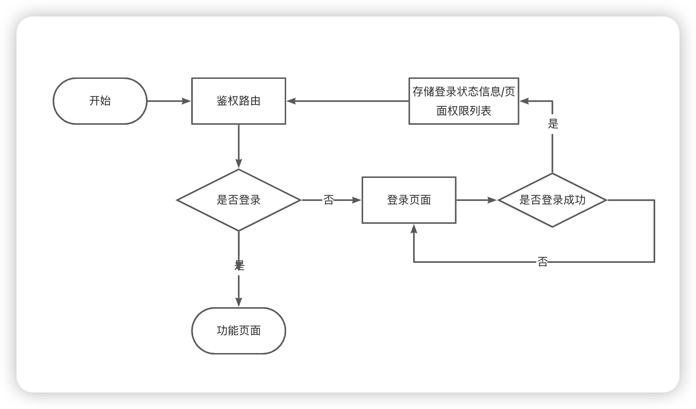

## 懒路由高阶组件

### 懒路由组件介绍

在比较复杂的项目中，每一个组件的渲染都要花费很多的时间，所以封装懒路由组件来实现懒路由加载，可以给所有的路由都包裹懒路由。

### 组件的实现

进入页面时，想要在组件加载完成之前展现 Loadding，可以用 Suspense 来实现。

### 组件的使用

实现的时候在注册路由的时候，将所有需要懒加载的组件都包裹在 Suspense 里面。**Suspense 需要配合 lazy 来使用，lazy 会返回一个 Promise 对象，这样在 Promise 的状态变成 resolved 之前会显示 fallback 中的 React 节点内容，resolved 之后就会显示通过 lazy 异步加载的 React 节点。**

```ts
// configs
import { lazy, Suspense } from 'react';
const createLazyRoute = (RouteComponent: any) => {
  return function (props: any) {
    return (
      <Suspense fallback={<Spin className="spin-lazyload-dtloading" />}>
    <RouteComponent {...props} />
    </Suspense>
  );
};
};

const Layout = createLazyRoute(lazy(() => import('@/layout')));

const LoginContainer = createLazyRoute(lazy(() => import('@/views/login')));

....

const RouterConfig = [
  {
    path:"/",
    component:LoginContainer
      ...
      }
]
```

### 路由守卫

使用 React-Router 实现路由守卫，通过默认路由跳转到守卫路由，然后在守卫路由中完成逻辑之后跳转到主路由。

例如如果**在路由之前要进行认证，可以将认证路由放在/根路由**，那么每次打开根路由之后的逻辑会进入到认证路由，认证路由负责判断登录认证状态，如果未登录则路由替换到登录页面，登录了就跳转到功能页面。登录页面完成登录后，记录登录状态，然后在鉴权路由中进行再一次选择（或者也可以直接跳转到功能页面）。其他子路由例如登录和功能的路由可以用/login/xxx 来做前缀。**在类似监听 cookie 的组件中，监听到没有登录信息的 cookie 等（未登录状态），则在组件中做跳转到根路由的逻辑即可。**


